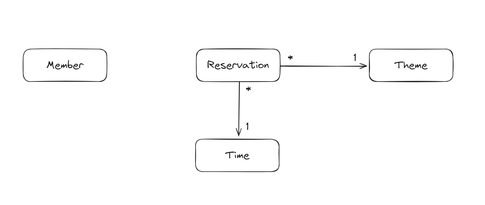
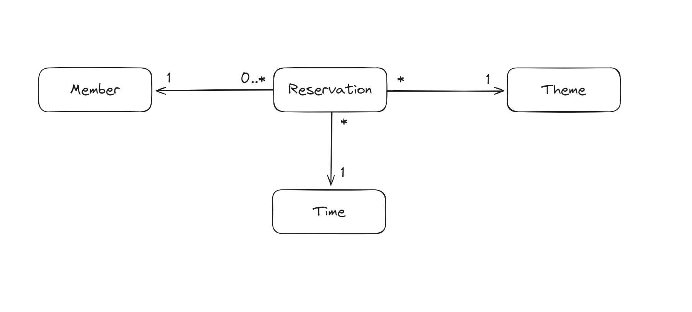
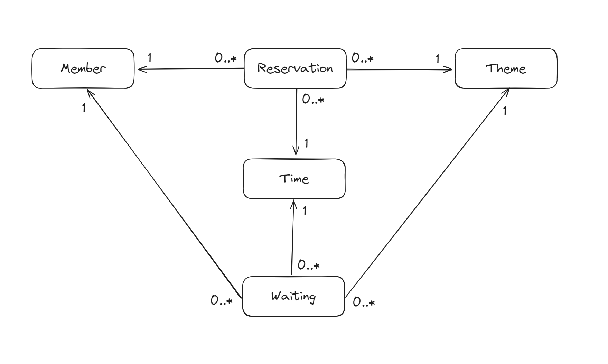

## 1단계 - 로그인
- [x] `POST /login` 구현
  - Http Request Body에 이메일과 비밀번호를 담아 전달하면 이를 통해 회원 조회
  - 발급한 JWT 토큰을 쿠키에 담아 반환

- [x] `GET /login/check` 구현
  - `HttpServletRequest`에서 `Cookie`를 꺼낸 뒤, `token` 값을 추출
  - Token에서 추출한 회원의 이름을 응답 바디에 담아서 반환
    - JWT를 생성할 때, Payload의 덩어리 중 하나인 `Claim`에 `name`이라는 키를 갖는 값을 넣어두었음.
    - 따라서 토큰을 복호화하여 Payload에 담긴 `name` 값을 가져올 수 있음.
    
- [x] 패키지 리팩토링 - `dto` 패키지 분리  
- [x] 토큰 생성하는 객체 분리  
- [x] `Closed` 된 리뷰 참고하기(https://github.com/next-step/spring-basic-roomescape-playground/pull/9/files#diff-00b248eb7ee095af211541b6c6ae4b2cd3c82b99efcedbabed5a23d3c908d6e9)

## 2단계 - 로그인 리팩터링
- [x] 쿠키를 통해 회원을 조회하는 기능 리팩터링
  - `ArgumentResolver`를 통해 컨트롤러에서 인증정보를 조회하는 로직을 분리.
  - 구현한 `ArgumentResolver`를 활용하여 `/reservation API` 리팩토링 후 테스트

## 3단계 - 관리자 기능
- [x] `HandlerInterceptor`를 구현하여, 컨트롤러의 메서드에 진입하기 전에 권한을 확인한다.
  - `preHandle`을 구현
  - 토큰의 Payload에 들어있는 `ROLE` 값을 확인하여 권환 확인


## 4단계 - JPA 전환
- [x] JPA를 사용하기 위한 의존성을 추가한다.
- [x] 패키지 구조를 변경한다. (repository / domain 패키지 추가)
- [x] DAO가 아닌 Repository를 사용한다.
- [x] 각 클래스들의 연관관계를 확인할 수 있는 다이어그램을 그린다.
- [x] 연관관계가 없는(다른 클래스를 참조하지 않는) 클래스를 엔티티로 매핑한다.
- [x] 연관관계가 있는 클래스들을 서로 매핑한다.



## 5단계 - 내 예약 목록 조회
- [x] 내 예약 목록을 조회하는 API를 구현한다.
- `GET /reservation-mine` 요청 시, Member와 Reservation 필드의 조합으로 조회한 Reservation 리스트를 반환한다.
- [x] 응답에 필요한 DTO를 새로 만든다.
- [x] Reservation 클래스에 Member와의 연관관계가 추가된다.
- Member는 Reservation이 있을 수도 없을 수도 있다.
- Reservation은 Member가 반드시 존재한다. 따라서 Reservation 쪽에서 Member를 알고 있는게 맞을 것 같다.
- [x] 클래스 다이어그램 수정하기



## 6단계 - 예약 대기 기능
- [x] 예약 대기를 추가하는 API를 구현한다.
  - 예약 대기도 예약과 비슷한 엔티티라고 생각한다.
  - [x] 예약 대기 엔티티 생성
  - [x] 컨트롤러, 서비스, 리포지토리 생성
- [x] 예약 대기를 삭제하는 API를 구현한다.
- [x] 예약 목록을 조회할 때, 예약대기 목록도 함께 조회한다.
  - [x] 기존의 ReservationService를 수정한다.
- [x] 중복 예약이 불가능해야 한다. (기능 추가하면 이단계 테스트 코드 실패함 : 중복 예약 검증)
  - [x] ReservationService에서 예약을 추가하기 전에 검증한다.


### 해야할 것들
1. 공통피드백 적용하기(Optional, 예외처리, 의존성 관계 정리(조영호님 세미나))
   - [x] Repository 반환 타입에 `Optional`로 감싸기
   - [x] 커스텀 예외 추가
2. 컨트롤러에 DTO를 반환하도록 리팩토링(ex, TimeService)
2. 컨트롤러가 서비스를 의존하도록 리팩토링(ex, ThemeController)
3. 서비스 계층 로직에서 라인이 20줄 넘어가는 부분 리팩토링(ex. ReservationService의 save())
4. 서브모듈 적용해서 properties 파일 형상관리 하기

### 추후 공부할 내용
1. Cookie 생성 시, `HTTP ONLY` 옵션을 활성화하는 이유
2.
해당 코드가 어떠한 기능을 수행하며, `Claims`가 어떠한 역할을 하는 객체인지 알아보기
```java
Long memberId = Long.valueOf(Jwts.parserBuilder()
        .setSigningKey(Keys.hmacShaKeyFor("Yn2kjibddFAWtnPJ2AFlL8WXmohJMCvigQggaEypa5E=".getBytes()))
        .build()
        .parseClaimsJws(token)
        .getBody().getSubject());
```
3. JPA 연관관계 복습
4. 데이터베이스 및 SQL 공부
